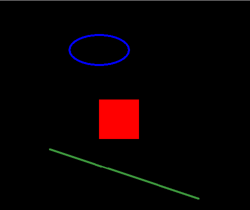

# Começando

## Passo 1: Criando um arquivo html 

Primeiro, você irá precisar de uma página HTML simples, como a mostrada abaixo:

``` html
<html>
<head>
  <meta charset="UTF-8">
  <script language="javascript" type="text/javascript" src="libraries/p5.js"></script>
  <script language="javascript" type="text/javascript" src="Jogo.js"></script>

  <style> body {padding: 0; margin: 0;} </style>
</head>

<body>
</body>
</html>
```
Ela servirá como meio de acesso ao seu arquivo de script, salve-a como "index.html".

## Passo 2: Criando uma arquivo de código JavaScript 

Abra o editor de sua preferência e digite o seguinte:
``` javascript
function setup() {

}

function draw() {
  ellipse(50, 50, 80, 80);
}
```
Salve este arquivo como *Jogo.js* (mesmo nomo usado dentro do arquivo HTML). 

O resultado da execução do arquivo index.html será: 


Para mais informações veja: 

* https://p5js.org/reference/#/p5/ellipse 

## Passo 3: Desenhando formas geométricas 

O processing tem diversas funções para desenho de formas, tais como `ellipse()`, `rect()`, `line()`, `point()`, `quad()`, `triangle()`... Todas elas precisam de informações como posição e tamanho, que são colocadas dentro dos parênteses.

No caso do código acima, uma elipse é desenhada na tela. Para isso, temos que informar as coordenadas e o tamanho da elipse usando *ellipse([coordenada x],[coordenada y], [largura], [altura])*. Salve o arquivo com o nome "Jogo.js" e abra o index no navegador.

Podemos também, brincar com a aparência dessas formas. No seu script, digite o seguinte:
``` javascript
function setup() {
	createCanvas(640, 480);
	background(0);
}

function draw() {
  noFill();
  stroke(0, 0, 255);
  ellipse(200, 100, 120, 60);
  noStroke();
  fill(255, 0, 0);
  rect(200, 200, 80, 80);
  stroke(60, 150, 60);
  strokeWeight(3);
  line(100, 300, 400, 400);
}
```
Resultado da execução:



A função createCanvas() define o tamanho da tela e o background() define sua cor de fundo. As funções fill() e stroke(), definem as cores de preenchimento e de contorno, respectivamente. Uma vez utilizadas essas funções, seus efeitos valerão para todas as formas declaradas abaixo. noFill() e noStroke(), retiram o preenchimento e o contorno, respectivamente, e strokeWeight() define uma espessura para o contorno da forma.
  
Agora vejamos algo mais interessante...

Primeiro teremos que saber o que são as funções setup() e draw(), que viemos utilizando aqui. Elas são usadas basicamente para organizar o fluxo do código. O setup(), é executado apenas uma vez, no começo, para declarações iniciais. Já o draw(), ficará se repetindo no decorrer da execução, nele poderemos fazer algo mudar seu valor ao longo do tempo. Um exemplo é a posição da ellipse, que pode ser alterada de acordo com a posiço do mouse!

Delete o script anterior e digite o seguinte: 

``` javascript
function setup() {
  createCanvas(640, 480);
  noFill();
}

function draw() {
  ellipse(mouseX, mouseY, 80, 80);
}
```
Resultado da execução:


Os parâmetros mouseY e mouseX, funcionam como variáveis que armazenam os valores da posição do mouse.

Agora vamos implementar um pouco esse código.

``` javascript
function setup() {
  createCanvas(640, 480);
  noFill();
}

function draw() {
  if (mouseIsPressed){
    ellipse(mouseX, mouseY, 100, 100);
  }
}

```

A variável mouseIsPressed é uma boleana, nela é armazenado true para o caso de o botão do mouse estar sendo pressionado e false para o caso do botão estar solto.

A função random(min, max) também pode ser muito útil para diversas aplicações.
	
``` javascript
function setup() {
  createCanvas(640, 480);
  noFill();
}

function draw() {
  if (mouseIsPressed){
    ellipse(mouseX, mouseY, random(100, 200), random(100, 200));
  }
}

```

Também podemos criar nossas próprias variáveis.

``` javascript
var posX, posY;

function setup() {
  createCanvas(640, 480);
  posX = 0;
  posY = 200;
}

function draw() {
  background(0);
  if (posX < 640){
	posX = posX + 15;
  }else{
	posX = 0;
  }
  ellipse(posX, posY, 50, 50);
}
```

Aqui, criamos as variáveis antes das funções, para que elas possam ser usadas em todos os lugares do código. No setup(), damos valores iniciais, visto que o setup só é executado uma única vez. No draw(), verificamos se a posição X do círculo está dentro do nosso canvas, se está verdadeiro, a variável da posição X é incrementada fazendo com que o círculo ande pela tela na horizontal, se ele sai do canvas, a posição X volta para zero (0) e o ciclo recomeça. O background está sendo repintado no draw() para evitar que o círculo deixe um rastro na tela; primeiro é pintado um fundo, depois o círculo é pintado em uma posição X, depois o fundo é pintado novamente e só então um novo círculo é pintado, em uma nova posição X. Experimente retirar a função background e veja o que acontece.

